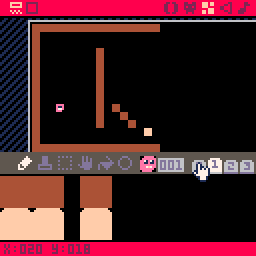

### Hello Pico8

Here's some resources to get over the basics of Pico8.

[User Manual](https://www.lexaloffle.com/pico8_manual.txt)

[Shooter Tutorial](https://ztiromoritz.github.io/pico-8-shooter/)

[Celeste Platformer Game](https://www.lexaloffle.com/bbs/?tid=2145)

But don't be discouraged by Pico8. Principles applies to other engines as well.

### Rendering the tiles

Pico8 console is 128x128 and each tile is 8x8 pixels so a screen can take 16x16 tiles. So
make a player sprite, and some tile sprites, and go to map editor and make a 16x16 room.

Add floors on the bottom and wall's on the side, and a floor above the ground to test graceful jumping after leaving the floor. Add the player sprite where the player should be spawned.

On the `_draw` function call `map` to draw tiles with flags 0x2, and make sure to set your floor tiles #2 flag.

    map(0,0,0,0,16,16,0x2)

Here is 3 helper functions for querying the map. 
* `tile_at(x,y)` returns the tile on given cell coordinates
* `tile_flag_at(x,y,w,h,flag)` returns if any tile's `flag` is set inside given area.
* `solid_at(x,y,w,h)` returns if any solid tile is inside given area.

Using these functions we can do collision detection. Refer to Celeste source code for implementations.

### Debugging

Define a variable `DBG` and print it in draw function, set it's value to anything inside update loop to print it later. Also you can define your own debug rendering functions. These examples prints if tiles are solid or not inside those tiles on the screen:

    function debug_draw()
       for i=0,15 do
          for j=0,15 do	
             draw_solid(i,j,1,1)
          end
       end
    end

    function draw_solid(x,y,w,h)
       local s = solid_at(x*8, y*8, w, h)
       local res
       if(s) then res="1"
       else res="0"
       end
       print(res, x*8, y*8)
    end

### Code Architecture

The floor tiles, background tiles, spikes are all drawn using `map` and queried from the map. Other objects like player, moving platforms, falling floors, are objects with position and custom update and draw functions, put into a table.

In the `_init` function we define `objects` table and call `load_map`.

    function _init()
       objects={}
       load_map()
    end

`load_map` iterates over each tile, makes a new object for tile, sets it's position and adds it to the `objects` table.

    function load_map()
       for i=1,16 do	
          for j=1,16 do
             local tile = mget(i,j)
             local obj
             if tile==1 then
                obj = player()
             end
             if obj!=null then
                init_object(obj,i*8,j*8)
             end
          end
       end
    end

    function init_object(obj,x,y)
       add(objects, obj)
       obj.x = x
       obj.y = y
       return obj
    end

`player` is a function that returns the player object:

    function player()
       local p = {
          x=0,
          y=0,
          dx=0,
          dy=0,
          ax=0,
          ay=0,
          move=object_move,
          update=player_update,
          draw=player_draw,
          cbox={ x=0,y=0,w=6,h=6 }
       }
       return p
    end

`x y dx dy ax ax` are position velocity and acceleration properties. `move update draw` are custom functions, `cbox` is the aabb collision box.

In the `_update` method we iterate `objects` and move and update each object.

    function _update()
      for obj in all(objects) do
        obj.move(obj)
        obj.update(obj)
      end
    end

In the `_draw` method we draw each object:

    function _draw()
      cls()
      map(0,0,0,0,16,16,0x2)
      for obj in all(objects) do
        obj.draw(obj)
      end
    end

We have added `tile=1` as a player object so `player_draw`, `player_update` and `player_move` functions are called for the player. We simply draw a sprite on `player_draw`:

    function player_draw(p)
       spr(1,p.x,p.y)
    end

`player_update` and `player_move` functions will be discussed in the [main article](README.md)
