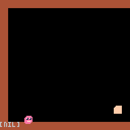

## Making a Platformer in Pico8

This is an analysis of Pico8 Celeste platformer game source code. Game includes movement, collisions, jumping, wall sliding, dashing, moving platforms, pickups, linear level progression, and various platformer tricks to make it feel good. I don't discuss about music or sound making.

### Hello Platformer

Three main issues I encountered with making a platformer. Physics, collisions, levels, also the camera. Here's two resources about physics I used:

[Simple Physics Based Movement](https://stackoverflow.com/questions/667034/simple-physics-based-movement)

[Building a Better Jump](https://www.youtube.com/watch?v=hG9SzQxaCm8)

These define the parameters of the movements by means of sensible values. First one finds the friction and acceleration by means of maximum velocity and time needed to reach the maximum velocity. Second one finds the gravity and initial velocity by maximum velocity, maximum jump height, maximum horizontal distance taken during the jump. It also discusses about double jumping, and variable height jumping which are basically done by changing the gravity.

Collisions; I mention some of the resources that helped me  in this [question; simple collision resolution in a platformer game](https://gamedev.stackexchange.com/questions/184194/simple-collision-resolution-in-a-platformer-game). But I discarded them when I discovered [Celeste Source Code in C#](https://github.com/NoelFB/Celeste). Celeste separates X and Y axis movement, and moves the objects in small steps until they collide, in which case the collision is detected and resolved before happening. Here are some more resources that talk about Celeste: [Celeste by Game Maker's Toolkit](https://www.youtube.com/watch?v=yorTG9at90g), and [Celeste Physics by Matt Thorson](https://medium.com/@MattThorson/celeste-and-towerfall-physics-d24bd2ae0fc5).

Levels are done using Pico8 map editor which I will mention how Celeste does it in this article.

For camera, I decided to use a horizontal side scroller to add some variety to this research. Here's a good resource about;

[How Camera's work](https://www.youtube.com/watch?v=pdvCO97jOQk).

Make sure to first read [Pico 8 Basics](PICO8.md), that covers how to render tiles, debugging, code architecture on Pico8.

### Handling Input and Horizontal Movement

Here's our `player_update` function so far:

    function player_update(p)
      local input_x
      local input_j

      if btn(⬅️) then
         input_x = -1
      elseif btn(➡️) then
         input_x = 1
      else
         input_x = 0
      end

      if btn(⬆️) then
        input_j = true

      // h move
      local _h_accel = 
         input_x * h_accel
      p.dx += _h_accel
      p.dx += - p.dx * x_friction
    end

Apart from getting the input, we set player's `dx` property. First adding `input_x * h_accel`, that is the horizontal acceleration multiplied by the input direction. Next we subtract `p.dx * x_friction` which slows down's the horizontal velocity and halts to zero. These formulas are explained in [this SO article](https://stackoverflow.com/questions/667034/simple-physics-based-movement). `h_accel` and `x_friction` are derived from:

    t_max = 10
    v_max = 5
    x_friction = 5 / t_max
    h_accel = v_max * x_friction

`t_max` is the time to reach the maximum velocity,
and `v_max` is the maximum velocity which are both tweakable parameters.

We only updated the player's velocity we haven't actually moved the player. Because movement involves collision detection, we will see that next.

### Collision Resolution while Moving the Player

We are updating the player's velocity on `player_update` now we will use that to set the position in `player_move`(which is called `object_move`):

    function object_move(obj)

       local amount = 0

       amount = flr(obj.dx + 0.5)

       object_move_x(obj, amount)

       // you can uncomment these to enable
       // vertical movement
       // amount = flr(obj.dy + 0.5)
       // object_move_y(obj, amount)
    end

First `object_move_x` called by `obj.dx` amount, next `object_move_y` called.

    function object_move_x(obj, 
                           amount)

       if (amount == 0) then 
          return 
       end

       local step = sgn(amount)
       for i=0,abs(amount) do
          if not is_solid(obj, step, 0) then
             obj.x += step
          else
             obj.dx = 0
             break
          end
       end
    end

`obj.x` is increased by 1 in a for loop each time looking for a collision using `is_solid` function. Let's take a look at how it works:

     function is_solid(obj, x, y)
       local cbox = abs_cbox(obj)
       return solid_at(cbox.x + x, 
                       cbox.y + y,
                       cbox.w,
                       cbox.h)
      end

     function abs_cbox(obj)
        local box = {
           w=obj.cbox.w,
           h=obj.cbox.h}
        box.x = obj.x+obj.cbox.x
        box.y = obj.y+obj.cbox.y
        return box
     end

`abs_cbox` returns the object's collision box in world space. `is_solid` takes `x y` parameters that adds to the object's collision box, so `is_solid(obj, 0, 0)` looks for object's current location while `is_solid(obj, 1, 0)` looks for object's one tile right, if it's solid or not. See [the included source file](pre.p8) for full reference.

If it's not solid we move by step amount and keep looping otherwise we set the velocity to 0 and break out of loop.

`object_move_y` is similar, one thing to note is in `object_move_x` we look for `is_solid(obj, step, 0)` while in `object_move_y` we look for `is_solid(obj, 0, step)`.

Now our character will respond to velocity updates done in `player_update` function.
    

### Jump once per ⬆️ press

Let's handle input first, add this to `player_update`:

     if btn(⬆️) then
        input_j = true and not p.p_jump
     end
     p.p_jump = btn(⬆️)
     if (input_j) then
        p.j_buffer = 4
     elseif (p.j_buffer > 0) then
        p.j_buffer -= 1
     end

`j_buffer` property will count down 4 frames after ⬆️ is pressed, and will not update on holding jump, that means you need to release the key and press again for `j_buffer` to activate.

Next actual jumping physics:

     if (p.j_buffer > 0) then
       p.ay = -g_jump
       p.dy = -v0_jump
     end

     p.dy += p.ay

When jumping we give player an initial velocity and an acceleration which is gravity. And everytime we add acceleration to the velocity. These `g_jump` and `v0_jump` values are derived as well:

    v_max = 5
    h_max = 8 * 3
    x_sub_h = 8 * 6

    v0_jump = (2 * h_max) * 
       v_max / x_sub_h
    g_jump = - (2 * h_max * v_max * v_max) /
       (x_sub_h * x_sub_h)

`h_max` is the maximum jump distance, in this case 3 tiles up, and `x_sub_h` is x distance covered while in the air.
[This video](https://www.youtube.com/watch?v=hG9SzQxaCm8) explains how to derive these.

Add this also to detect if we are in ground we will use it next:

     local is_grounded = 
        is_solid(p, 0, 1)

When we jump we apply a gravity acceleration to our player, but if our character were to move on x axis and fall from a cliff, it wouldn't fall, let's cover that:

       local g_fall = -g_jump
       if (not is_grounded) then
         // fall gravity
         p.ay = g_fall
       end

I set falling gravity to `-g_jump` but it could be something else.

### Jump only on ground and jump fall grace or "Coyote Fall"

Now the player can jump continously while in the air:

To fix this, we introduce the `grace` timer, as a property on the player object.

    local p = {
       grace=0,
       //...

then, update inside `player_update`:

    if (is_grounded) then
      p.grace = 6
    elseif (p.grace > 0) then
      p.grace -= 1
    end

then add as a guard on our jump code:

     // jump
     if (p.j_buffer > 0) then
        if (p.grace > 0) then
           p.ay = -g_jump
           p.dy = -v0_jump
           p.grace = 0
        end
     end

This timer starts ticking down as soon as we leave the ground, (like running off of a platform or jumping), and allows for 6 frames to be able to jump if not already, of course if we jumped we set it to 0 so we don't jump again.

Play yourself by landing on a higher floor and running off the edge, and try to jump after you have left the floor. Change the timer to 1 to notice the difference.

### Wall Slide

Similar to how we applied friction drag to horizontal movement, we will add vertical friction drag for wall slide.

`v_slide_drag` will control how much to apply vertical friction drag:

     local v_slide_drag = 0

     // wall slide
     if (input_x != 0 and is_solid(p, input_x, 0)) then
        if sgn(p.dy)>0 then
           v_slide_drag = 1
        end
     end

Outer check is checking if there is a wall on the `input_x` direction, and inner check is only allowing vertical drag if the player is going down. If we limit the velocity while sliding and going down, this will allow jumping player to continue to move up as colliding with a wall.

Finally apply the drag after we apply acceleration:

     p.dy += p.ay
     p.dy += -p.dy * x_friction * v_slide_drag

Feel free to suggest a better method, it didn't feel very stiff enough to me, also it uses `x_friction` which is the friction for horizontal drag.

### Fixing a rounding bug on movement

To make the wall slide slower, I multiplied `x_friction` by a factor like 1.2. This made `p.dy` to be a value less than 0.5. The player's movement stopped as `p.dy` were 0. This is a bug on our object movement code, so let's revisit that:

        function object_move(obj)

          local amount = 0

          if not obj.remx then 
             obj.remx = 0
          end

          obj.remx += obj.dx
          amount = flr(obj.remx + 0.5)
          obj.remx -= amount

          object_move_x(obj, amount)

          // same for y ...

        end

We account for remainder's so the `flr` operation doesn't lose them. Now if you multiply `x_friction` by 1.2 `p.dy` will be below 0.5 and it will slide more slower.

### Wall Jump

     // jump
     if (p.j_buffer > 0) then
        if (p.grace > 0) then
            // ...
        else
          // wall jump
          local wall_dir = 0
          if is_solid(p, -3, 0) then
             wall_dir = -1
          elseif is_solid(p, 3, 0) then
             wall_dir = 1
          end

          if (wall_dir != 0) then
             p.j_buffer = 0
             p.dy = -v0_jump
             p.dx = -wall_dir * h_accel * 2
          end

Inside the jump code if it's not a ground jump, we check for a wall and if there is we give the player some jump velocity.
