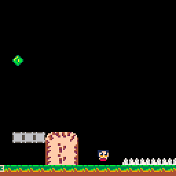

## Dead particles, player spawn, smoke and other effects

Matt Thorson says: "Your player needs to feel good in an empty room". The movement mechanics are a huge part of that. Also player animations and sound effects for death, spawn and movement adds to the fun.

### Dead Particles as in Megaman

Here's the final result:
.

Dead particles are objects with a position, speed and a life. They will move towards the position and get removed from objects when the life is over.

    function _init()
        dead_particles={}
        // ...
    end

    function _update()
       for p in all(dead_particles) do
          p.dx *= 0.9
          p.dy *= 0.9
          p.x += p.dx
          p.y += p.dy
          p.t -= 1
          if p.t <= 0 then
             del(dead_particles, p)
          end
       end
    end

And we draw them with circles:

    function _draw()
      for p in all(dead_particles) do
          circfill(p.x,p.y,3-p.t/5,14+p.t%2)
      end
    end

Finally we add them when we kill the player:

    
    function kill_player()
       for dir=0,7 do
          local angle = dir / 8
          add(dead_particles, {
                 x=p.x+4,
                 y=p.y+4,
                 t=10,
                 dx=sin(angle)*3,
                 dy=cos(angle)*3
          })
       end
    end

### Player Spawn

In celeste, For the player spawn, there is an object that plays the player spawn animation then adds the player object.

     player_spawn = {
        spr=1,
        delay=10,
        init=player_spawn_init,
        update=player_spawn_update
     }

Change `load_room` to add a `player_spawn` instead of a `player`:

         if tile==1 then
            type = player_spawn
         end

Here's `player_spawn_update`:

    function player_spawn_update(p)
        p.delay -= 1
        if p.delay<0 then
            destroy_object(p)
            init_object(player, p.x, p.y)
        end
    end

And add the dead particles on `player_spawn_init`:

    function player_spawn_init()
      for dir=0,7 do
        local angle = dir / 8
        local dx = sin(angle)
        local dy = cos(angle)
        add(dead_particles, {
               x=p.x+4 + dx * 10,
               y=p.y+4 + dy * 10,
               t=10,
               flipt=true,
               dx=-dx,
               dy=-dy
        })
      end
    end

The particles grow bigger instead of getting smaller in this case. This is left as an exercise to the reader.

### Add Smoke on movement

Player leaves a smoke trail when performing various movement. So draw a smoke animation that is three consecutive tiles. Smoke is an object we add to the `objects` table:

    smoke = {
        spr=24,
        spr_off=0,
        init=smoke_init,
        update=smoke_update
    }

`smoke_update` just does animation and destroys the smoke at the end:

    function smoke_update()
        s.spr+=0.2
        if s.spr>=24+3 then
            destroy_object(s)
        end
    end

`smoke_init` sets up initial parameters:

    function smoke_init()
       s.dy=-0.1
       s.dx=0.3+rnd(0.2)
       s.x+=-1+rnd(2)
       s.y+=-1+rnd(2)
       s.flipx=maybe()
       s.flipy=maybe()
    end

`maybe` returns random chance of 50/50:

    function maybe()
        return rnd(1)<0.5
    end

Finally the fun part add the particles as you wish, for example, when the player jumps on `player_update`:

     if is_grounded and not p.was_grounded or
        not is_grounded and p.was_grounded
     then
        init_object(smoke,p.x,p.y+4)
     end

or when the baloons disappear and reappear on `baloon_update`.

### Sound effects

Just like smoke, you can sprinkle sound effects whereever you wish. One thing to note is different sounds can play at the same time creating a mixed feeling. To fix that, we might add a `sfx_timer`, activate the timer for important sounds and play optional sounds only if the timer isn't active.

    function psfx(num)
        if sfx_timer<=0 then
            sfx(num)
        end
    end

Optional sounds will be played like `psfx(2)`, and important sounds will start the timer and play the sound:

    sfx_timer = 20
    sfx(0)

### Game Freeze, Camera Shake

When we dash we might want to freeze the game for a dramatic effect. So introduce a `freeze` timer:

    function _init()
        //...
        freeze=0
    end

    function _update()
        if freeze>0 then freeze-=1 return end
        //...
    end

    function _draw()
        if freeze>0 then return end
        //...
    end

And start the freeze timer for one frame when dash starts like `freeze=1`.

For camera shake we introduce `shake` timer.

    function _init()
        //...
        shake=0
    end

    function _draw()
        local shakex = 0
        local shakey = 0

        if shake>0 then
            shake-=1
            if shake>0 then
                shakex=(-1+rnd(1))*shake/5
                shakey=(-1+rnd(1))*shake/5
            end
        end

        //...
        camera(camx + shakex, shakey)

    end

And use it when dashing. But don't overuse these effects or it might affect the gameplay and become annoying.

Next you can read about [Title, More Levels, End](TITLE.md).
