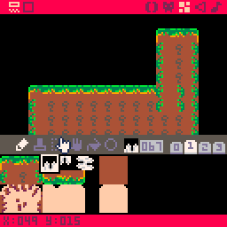

### Add Gaps and Spikes

Draw 4 spike tiles facing in each direction and add them to the map at various places.

Spike tiles should set the flag 1 like the solid tiles so they are drawn. But don't set flag 0 because they are not solid.

Also add some gaps between solid tiles so player can fall down.

### Spike Collision and Out of Screen

Add these checks after input handling on `player_update`:

    if is_spike(p) or p.y > 128 then
       kill_player(p)
    end

When player collides with spikes or goes out of screen we kill the player.

`is_spike` function is similar to `is_solid` function:

    function is_spike(obj)
       local cbox = abs_cbox(obj)
       local x = cbox.x
       local y = cbox.y
       local w = cbox.w
       local h = cbox.h

       for i=max(0,flr(x/8)),
       min(128, (x+w-1)/8) do
          for j=max(0,flr(y/8)),
          min(15,(y+h-1)/8) do
             local tile = tile_at(i, j)

             if tile==67 and (y + h - 1)%8>=6 and obj.dy >=0 then
                return true
             elseif tile==68 and y%8<=2 then
                return true
             elseif tile==69 and x%8<=2 then
                return true
             elseif tile==70 and (x+w-1)%8>=6 then
                return true
             end
          end
       end
       return false
    end

Except we check for spike tiles instead of solid flag. Additionally there are checks like `y%8<=2`, this limits the collision to the bottom of the spike so it doesn't collide if it's just above it.

These collisions are peculiar to Pico8, `is_spike` returns if a given object (player) is collided with a spike.

`kill_player` function destroys the player object and restarts the room.

    function kill_player(p)
       destroy_object(p)
       restart_room()
    end

    function restart_room()
       load_room()
    end

    function destroy_object(obj)
       del(objects, obj)
    end

In `load_room` we also destroy all the objects, which just removes them from the `objects` table.

    function load_room()

       foreach(objects,destroy_object)

       // rest of the function
    end

`restart_room` immediately reloads the room, but we will do some animation (later) and wait a few seconds before reloading the room. 

So add these variables on the `_init` function:

    function _init()
      // ...
      delay_restart=0
    end

Then modify `restart_room` as such:

    function restart_room()
       delay_restart=15
    end

Finally inside the `_update`, check for `delay_restart` and call `load_room` when delayed restart reaches 0:

    function _update()
      if delay_restart > 0 then
         delay_restart -= 1
         if (delay_restart <= 0) then
            load_room()
         end
      end
      // ...
    end

Next read about [Springs, Baloons, Falling Floors](SPRINGS.md).
