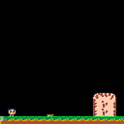
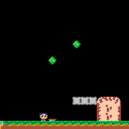

## Adding More objects, Springs, Baloons, Falling Floors
    
### Adding more objects

Until now we only had one player object, with properties like, `x, y`, `cbox`, `spr`. Now we want to add more objects, also add the same properties to these objects. So let's collect the common properties under a base object:

    function object_init(obj)
    end

    function object_update()
    end

    function object_draw()
        spr(obj.spr,obj.x,obj.y,1,1,obj.flipx,obj.flipy)
    end

    baseobject = {
        x=0,
        y=0,
        init=object_init,
        move=object_move,
        update=object_update,
        draw=object_draw,
        cbox={ x=0,y=0,w=8,h=8 },
        flipx=false,
        flipy=false
    }

The `object_draw` function is the default drawing method. It draws the objects `spr` property to `x y` position.

Remove the `player` method and just make it a table with custom properties, make sure functions like `player_update` are defined first before this definition:

    player = {
        dx=0,
        dy=0,
        cbox={ x=1,y=3,w=6,h=5 },
        // ...more properties
        update=player_update,
        draw=player_draw,
        init=player_init
    }

Our `init_object` method now looks like this:

    function init_object(type,x,y)
       local obj = {}

       merge(obj, baseobject)
       merge(obj, type)

       obj.type=type
       obj.x = x
       obj.y = y

       add(objects, obj)

       obj.init(obj)

       return obj
    end

We define a new `obj` table and extend it with `baseobject` template and given `type` template. Next we set the `obj.type` to be the given `type` we will check for it when we do collision detection.

`merge` is a helper function that merges one table into another, taken from [this comment](https://www.lexaloffle.com/bbs/?pid=51185#p). It will overwrite the existing properties.

    function merge(base, extend)
        for k,v in pairs(extend) do
            base[k] = v
        end
    end

Finally `init_object` in `load_room` will change, let's see how next.

### Spring jumps player into air

Add two spring tiles, one for the initial state, and one for the bouncing state. Dont set any flags. Place the spring tile on the map. Because you didn't set the flag 2, it won't be drawn when using the `map` function. Spring is an object and it will have it's own draw function (it will use the default draw function).

In `load_room`, add a new spring object when seen a spring tile (tile 71). Also note, how we init the player object:

     function load_room()
        for i=1,16 do	
         for j=1,16 do
             local tile = mget(i,j)
             local type
             if tile==1 then
                 type = player
             end
             if tile==71 then
                 type = spring
             end
             if type != null then
                 init_object(type, i*8, j*8)
             end
         end
        end
     end

See `player` is not a method anymore but a template (or a type) to create a player object. Define the `spring` type like the `player` type:

    function spring_update(ispring)

    end

    spring = {
        spr=71,
        update=spring_update
    }

We define the `spr` property to be the spring tile to draw. `spring_update` method will start being called for a spring object, `ispring` parameter is the spring object. Do mind the `spring` variable is globally defined as a type. Next, let's define spring's update logic.

When spring collides with the player, we jump the player into air:

    
    function spring_update(ispring)
       local hit = collide_object(ispring, 
                                  player,
                                  0,
                                  0)
       if hit != nil then
          ispring.spr = 72
          hit.y = ispring.y - 4
          hit.dx *= 0.2
          hit.dy=v0_jump * 2
          hit.djump=1
       end
    end

First we check if the spring is hit with a player using `collide_object`. If there is a hit,
we adjust the player's speed, and replenish the dash.

`collide_object` will check if object collides with a given type of object in this case spring collides with player:

    function collide_object(obj, type)
       local cbox = abs_cbox(obj)

       local other
       for i=1,count(objects) do
          other=objects[i]

          if other != nil and other.type == type and other != obj then

             local cbox2 = abs_cbox(other)
             if box_intersects(cbox, cbox2) then
                return other
             end

          end
       end
       return nil
    end

    function box_intersects(a, b)
       return a.x + a.w > b.x and
          a.y + a.h > b.y and
          a.x < b.x + b.w and
          a.y < b.y + b.h
    end

One problem is the spring doesn't return to it's resting state once the jump is over: .

Define a delay timer on spring:

    spring = {
        delay=0,
        // ...
    }

Start the delay timer when spring hits, and set the `spr` back to resting state when the timer runs out:

    if hit != nil then
       //... more 
      ispring.delay = 10
    end

    if ispring.delay > 0 then
        ispring.delay -= 1
        if ispring.delay <= 0 then
            ispring.spr=71
        end
    end

71 is resting state tile, 72 is jump state tile. When the spring is hit we set the `spr` to 72, then we set it back to 71 when the delay timer runs out.

### Baloon replenishes dash

Baloon can be collected and replenishes dash, and reappears after a delay.

Add a baloon sprite and place it in the map, like we did with springs. Define the ballon type and add it to the objects in `load_room`:

    // inside load_room
         if tile==19 then
           type = baloon
         end
    // ...

    function baloon_update(ibaloon)
    end

    baloon = {
        spr=19,
        timer=0,
        cbox={x=-1,y=-1,w=10,h=10},
        update=baloon_update
    }

Add the `baloon_update` logic, it's self explanatory similar to spring:

    function baloon_update(ibaloon)
       local hit = collide_object(ibaloon, player)

       if ibaloon.spr == 19 then
          if hit != nil and hit.djump == 0 then
             hit.djump = 1
             ibaloon.spr=0
             ibaloon.timer=60
          end
       elseif ibaloon.timer > 0 then
          ibaloon.timer -= 1
       else
          ibaloon.spr=19
       end
    end

You may note that, for simplicity, we are checking the object's `spr` property to decide what to do. This might not be ideal for more complicated situations.

### Falling Floor dissapears when player touches

Falling Floor is a solid tile where player can stand but dissapears after a while, letting the player fall and reappears again after a while more.

Draw three tiles side by side for a falling floor that breaks. Add it as an object just like other objects. Here's the `fall_floor` object template:

    fall_floor = {
       spr=87,
       state=0,
       delay=0,
       update=fall_floor_update,
       draw=fall_floor_draw
    }

`fall_floor` has 3 states:

0 is the normal solid state, in this state it checks if any player collides with it, in case it goes to state 1.

1 is the falling state, in this state it counts down a timer to go to state 2, also it plays the breaking animation.

2 is the dissapear state, in this state it is not solid anymore and player falls through. Also it counts down a timer to go to state 0.

Here's the code version:

    function fall_floor_update(ifall)
       if ifall.state == 0 then
          if check_object(ifall, player, 0, -1) or
             check_object(ifall, player, -1, 0) or
             check_object(ifall, player, 1, 0) then
                ifall.state = 1
                ifall.delay = 15
          end
       elseif ifall.state == 1 then
          ifall.delay -= 1
          if ifall.delay <= 0 then
             ifall.state = 2
             ifall.delay = 60
             ifall.collideable = false
          end
       elseif ifall.state == 2 then
          ifall.delay -= 1
          if ifall.delay <= 0 and 
          not check_object(ifall, player, 0, 0) then
                ifall.state = 0
                ifall.collideable = true
          end
       end
    end

There are two things to note here, one is the `check_object` where we simply check if it collides with any object of given type:

    function check_object(obj, type, x, y)
        return collide_object(obj, type, x, y) != nil
    end

Note that now `collide_object` takes two parameters `x, y`, which offsets the collision hitbox check. For example `check_object(ifall, player, -1, 0)` looks if there is a player left of `ifall` object.

Also objects can have `collideable` property to declare as collidable or not, we refactor `collide_object` in account for these:

    function collide_object(obj, type, x, y)
        local cbox = abs_cbox(obj)
        cbox.x += x
        cbox.y += y

        local other
        for i=1,count(objects) do
            other=objects[i]

            if other != nil and other.type == type and 
                other != obj and other.collideable then
            // .. rest of the code is the same
    end

Give the `baseobject` default `collideable` property of true. Also refactor all the usages of `collide_object` to give an `x y` value of 0.

This is the result 

The player doesn't stand on the fall floors but the logic works fine otherwise. We have to add the fall floors in the `is_solid` check as a solid tile.

    function is_solid(obj, x, y)
        local cbox = abs_cbox(obj)
        return solid_at(cbox.x + x, 
            cbox.y + y,
            cbox.w,
            cbox.h) or
            check_object(obj, fall_floor, x, y)
    end

Next, you can read about [Dead particles, player spawn, smoke and sound effects](SPAWN.md)
