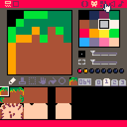
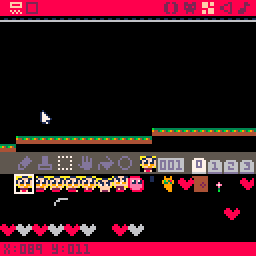

### Make Graphics

Make some player animations and floor tiles

We will change our `player_draw` function as such:

    function player_draw(p)
      spr(p.spr,p.x,p.y,1,1,p.flipx,p.flipy)
    end

Add these properties to the player object:

      flipx=false,
      flipy=false,
      spr_off=0

Finally set the `spr` property according to player state:

     --facing
     p.flipx=p.dx<0

     p.spr_off += 0.25
     if not is_grounded then
        if (wall_dir != 0) then
           p.spr = 5
        else
           p.spr = 3
        end
     elseif btn(⬇️) then
        p.spr=6
     elseif btn(⬆️) then
        p.spr=7
     elseif p.dx == 0 or input_x == 0 then
        p.spr=1
     else
        p.spr=1+p.spr_off%4
     end

Now our player is changing sprites depending on it's state.

### Horizontal Scrolling Camera

Make a map that extends to the map editor's width.  Map editor has 8 * 16 cells, screen takes 16 cells. 1 cell is 8 pixels.

    screen_x = 16 * 8
    max_x = screen_x * 8

    function _init()
        followx = 0
    end

`screen_x` is screen width, `max_x` is map's width, in pixels. `followx` is going to follow our `player.x`.

     local distance = abs(followx - p.x)
     local smoothing = flr((distance / 64) * 8)
     followx = appr(followx, p.x, smoothing)

`appr` approaches `value` to `target` by a specified `amount`.

    function appr(val,target,amount)
     return val > target 
        and max(val - amount, target) 
        or min(val + amount, target)
    end

`followx` will slowly approach `player.x` by a smoothing factor based on `distance`. This means camera will catch up to player quicker if they are further apart, like player is on the edge of the screen, and won't move much unnecessarily if they are closer.

    function _draw()
       cls()

       local camx = clamp(followx - 64, 
                          0,
                          max_x-screen_x)
       camera(camx, 0)
       map(0,0,0,0,128,16,0x2)
       // ... draw more
    end

    function clamp(val,a,b)
        return max(a, min(b, val))
    end

`map(0,0,0,0,128,16,0x2)` function draws the whole map that is 0 to 128 cells which we drew on the map editor. But only 16 cells are shown on the screen at a time. It starts from 0 unless we use `camera`.

We call `camera(camx, 0)` before drawing anything, this offsets x position of everything drawn by `camx` amount. So `camx` value of 16 will show the drawn map starting from cell 16. We set the camx to `followx - 64` this will draw the player at the center of the screen.

`clamp` will constraint a value between minimum and maximum values. In this case 0 and `max_x` so the camera stops on the edges of the map.

We also restrict the player movement to the map by adding this to the `player_update` function:

      -- clamp in screen
     if p.x<-1 or p.x>max_x-7 then 
        p.x=clamp(p.x,-1,max_x - 7)
     end

Now we can move the player around the whole map while smoothly scrolling. One thing to mention is the `is_solid` method when we do collision detection. It takes into account the whole map using this helper function:

     function tile_flag_at(x,y,w,h)
        for i=max(0,flr(x/8)),
        min(128, (x+w-1)/8) do
           for j=max(0,flr(y/8)),
           min(15,(y+h-1)/8) do
              if fget(tile_at(i,j),flag) then
                 return true
              end
           end
        end
        return false
     end

