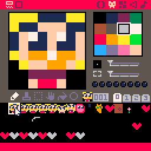

### Make Graphics

Make some player animations and floor tiles

We will change our `player_draw` function as such:

    function player_draw(p)
      spr(p.spr,p.x,p.y,1,1,p.flipx,p.flipy)
    end

Add these properties to the player object:

      flipx=false,
      flipy=false,
      spr_off=0

Finally set the `spr` property according to player state:

     --facing
     p.flipx=p.dx<0

     p.spr_off += 0.25
     if not is_grounded then
        if (wall_dir != 0) then
           p.spr = 5
        else
           p.spr = 3
        end
     elseif btn(⬇️) then
        p.spr=6
     elseif btn(⬆️) then
        p.spr=7
     elseif p.dx == 0 or input_x == 0 then
        p.spr=1
     else
        p.spr=1+p.spr_off%4
     end
